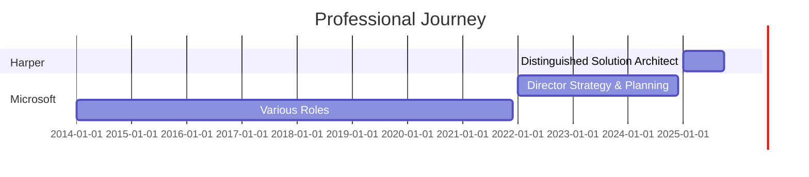

<!-- ANIMATED TYPING HEADER -->

<!-- SOCIAL MEDIA BADGES -->

---

## About Me

Distinguished Solution Architect with extensive experience in cloud platforms, developer tools, and distributed systems. Spent 11 years at Microsoft, including serving as Director of Strategy & Planning for Microsoft Learn and Azure Portal in the Azure Experiences & Ecosystems Division.

**Expertise:**
- Solution Architecture & System Design
- Cloud Platforms (Azure, AWS, GCP)
- Developer Tools & Ecosystems
- Technical Leadership & Strategy

**Current Focus:** Building innovative solutions at Harper, leveraging Python, Node.js, and modern cloud-native architectures.

**Location:** Three Forks, Montana

---

## Current Work

**What I'm focused on:**
- Architecting scalable systems at Harper
- Cloud-native application development
- Developer tools and productivity
- Open source contributions

**Ask me about:** Solution architecture, cloud platforms, developer ecosystems, or building effective engineering teams

---

## Technical Skills

### Languages

### Frameworks & Tools

### Cloud & DevOps

---

## GitHub Activity

---

## Featured Projects

<table>
<tr>
<td width="50%">

</td>
<td width="50%">

</td>
</tr>
<tr>
<td width="50%">

</td>
<td width="50%">

</td>
</tr>
</table>

---

## Professional Experience

### Distinguished Solution Architect @ Harper
**2025 - Present**

Architecting scalable, cloud-native solutions with focus on developer productivity and system reliability.

**Technologies:** Python, Node.js, FastAPI, Fastify

---

### Director, Strategy & Planning @ Microsoft
**2022 - 2024 · Azure Experiences & Ecosystems Division**

Led strategic planning and execution for Microsoft Learn and Azure Portal. Drove platform strategy, developer experience improvements, and ecosystem growth initiatives.

**Prior Microsoft Roles:** 2014 - 2022 (11 years total at Microsoft)

**Focus Areas:** Strategic Planning, Developer Platforms, Cloud Architecture, Ecosystem Development

---

## Key Accomplishments

- **11 years at Microsoft** (2014-2024), culminating in Director of Strategy & Planning for Microsoft Learn and Azure Portal
- **Led strategic initiatives** for developer platforms and ecosystem growth in Azure Experiences & Ecosystems Division
- **Distinguished Solution Architect** at Harper, focusing on scalable cloud-native architectures
- **Extensive experience** in solution architecture, cloud platforms (Azure, AWS, GCP), and developer tools
- **Active contributor** to open source and technical communities

[View full professional history on LinkedIn](https://linkedin.com/in/irjudson)

---

**Ivan R. Judson** | Three Forks, Montana

