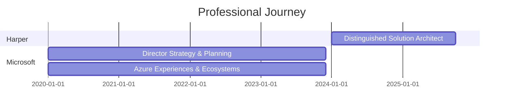

<div align="center">

<!-- ANIMATED TYPING HEADER -->
[](https://git.io/typing-svg)

<!-- SOCIAL MEDIA BADGES -->
[](https://linkedin.com/in/irjudson)
[](https://twitter.com/irjudson)
[](https://www.irjudson.org/)
[](https://bsky.app/profile/irjudson.bsky.social)

<!-- VISITOR COUNTER -->


</div>

---

## 👨‍💻 About Me

```typescript
const IvanJudson = {
    pronouns: "He" | "Him",
    location: "Three Forks, Montana",
    code: ["Python", "Ruby", "JavaScript", "C"],
    askMeAbout: ["architecture", "cloud solutions", "developer tools", "open source"],
    technologies: {
        frameworks: {
            backend: ["Node.js", "Flask", "FastAPI", "Fastify"],
            tools: ["Harper"]
        },
        cloudPlatforms: ["Azure", "AWS", "GCP"],
        databases: ["PostgreSQL", "MongoDB", "Redis"],
        devOps: ["Docker", "Kubernetes", "CI/CD"]
    },
    currentRole: "Distinguished Solution Architect @ Harper",
    currentFocus: "Loving life, building cool technology",
    funFact: "From Three Forks, Montana - where the rivers meet 🏔️"
};
```

---

## 🛠️ Tech Stack

### 💻 Languages


### ⚙️ Frameworks & Tools


### ☁️ Cloud & DevOps


---

## 📊 GitHub Statistics

<div align="center">

<!-- GITHUB STATS CARD -->


<!-- GITHUB STREAK STATS -->


</div>

<div align="center">

<!-- TOP LANGUAGES -->


</div>

<!-- GITHUB TROPHY -->
<div align="center">

[](https://github.com/ryo-ma/github-profile-trophy)

</div>

<!-- CONTRIBUTION ACTIVITY GRAPH -->
<div align="center">

[](https://github.com/ashutosh00710/github-readme-activity-graph)

</div>

---

## 🎯 Current Focus

```yaml
🔭 Working on: Building cool technology at Harper
🌱 Location: Three Forks, Montana
💡 Philosophy: Loving life while solving complex problems
💬 Ask me about: Solution architecture, cloud platforms, developer tools
⚡ Fun fact: Where the three rivers meet - the headwaters of the Missouri 🏔️
```

---

## 🚀 Featured Projects

<div align="center">

<!-- PROJECT 1 -->
[](https://github.com/irjudson/github-profile-upgrade)

<!-- PROJECT 2 -->
[](https://github.com/irjudson/vam-tools)

</div>

---

## 💼 Work Experience



### 🏢 Distinguished Solution Architect @ Harper
**📅 2024 - Present** | **📍 Remote**

Building innovative solutions and architecting scalable systems.

**Technologies:** Python, Node.js, FastAPI, Fastify, Harper

---

### 🏢 Director, Strategy & Planning @ Microsoft
**📅 2020 - 2023** | **📍 Azure Experiences & Ecosystems**

Led strategic initiatives for Azure developer experiences and ecosystem growth.

**Technologies:** Azure, Cloud Architecture, Developer Tools

---

## 🏆 Achievements

- 🌟 Distinguished Solution Architect at Harper
- 📊 Former Director at Microsoft Azure
- 🎤 Technical Leadership & Strategy
- 💼 Solution Architecture & Cloud Platforms
- 🔧 Open Source Contributor

*For more achievements and details, see my [LinkedIn profile](https://linkedin.com/in/irjudson)*

---

## 📫 How to Reach Me

<div align="center">

[](https://linkedin.com/in/irjudson)
[](https://twitter.com/irjudson)
[](https://www.irjudson.org/)
[](https://bsky.app/profile/irjudson.bsky.social)
[](https://github.com/irjudson)

</div>

---

## 🐍 Contribution Snake Animation

<div align="center">


</div>

---

<div align="center">

### 💭 Quote of the Day


### 😄 Random Dev Joke


---

⭐️ From [irjudson](https://github.com/irjudson) | Three Forks, Montana 🏔️

**Thanks for visiting! Let's connect and build something amazing together! 🚀**

</div>
