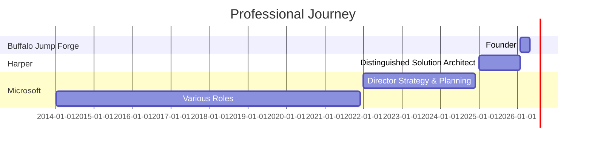

<!-- ANIMATED TYPING HEADER -->

<!-- SOCIAL MEDIA BADGES -->

---

> *"When every human finds a way to thrive doing what aligns their passion and talent, we have all won."*

---

## About Me

Founder of **Buffalo Jump Forge**, an AI + hardware practice based in Three Forks, Montana. After 11 years at Microsoft (most recently Director of Strategy & Planning for Microsoft Learn and Azure Portal) and then a Distinguished Solution Architect at Harper, I've turned my attention to the intersection of two things I love most: applied AI systems and custom electronics — agents, firmware, PCBs, and the glue that ties them together.

**Expertise:**
- **AI Systems & Agents** — Multi-model orchestration, LLM tool use, retrieval, local-first AI (Claude, Gemini, Ollama)
- **Embedded Systems & Firmware** — ESP32, C/C++, RTOS, sensor integration
- **PCB Design & Hardware Bring-Up** — KiCAD, small-batch manufacturing, design-for-test
- **Distributed & Cloud-Native Software** — Python, Node.js, Go
- **Solution Architecture & Technical Strategy**

**Current Focus:** Memento (my local-first AI supervisor) plus three hardware + software systems through Buffalo Jump Forge — ranch infrastructure, astronomy, and LED — each built end-to-end from PCB through firmware to the software and AI glue around it.

**Location:** Three Forks, Montana

---

## Flagship Project: Memento

> **Memory-Indexed Reflective Reasoning and Orchestration Runtime**
>
> A local-first AI supervisor that routes between Claude, Gemini, and Ollama — injecting your personal principles and project context into every conversation. Always available: web chat UI, WhatsApp notifications, and desktop alerts, all from a persistent daemon on your own machine.

**What makes it interesting:**
- **4-stage agentic pipeline** — Gather (tool-capable model) → Synthesize (local reasoning) → Plan (risk-tiered actions) → Execute (with human-in-the-loop on irreversible changes)
- **Privacy gate** — personal data is hard-blocked from cloud backends; routing is driven by privacy class, trust tier, capability, and cost
- **Semantic memory** — conversation history and project context stored as plain markdown, indexed with ChromaDB for fuzzy recall
- **Trust tiers** — models earn autonomy through demonstrated reliability, promoted automatically via nightly reflection
- **Live tool use** — git, GitHub, docker, filesystem ops injected as context before the model responds

Built on Python, Claude Code CLI, Ollama (DeepSeek-R1), ChromaDB, Twilio, and a lot of opinionated routing. *Private while under active development.*

---

## Current Work

**What I'm building at Buffalo Jump Forge:**
- **Memento** — Local-first multi-model AI supervisor (see above)
- **Ranch Infrastructure** — Custom PCB-based sensing and control for Buffalo Jump Ranch (telemetry, automation, off-grid comms)
- **Astronomy Systems** — Hardware hacks and software tooling around the ZWO Seestar S50 and a broader astrophotography workflow
- **LED Systems** — Driver boards, matrix controllers, and firmware for programmable LED projects

**Ask me about:** Agentic AI systems, multi-model routing, embedded firmware, PCB design for small-batch hardware, ESP32 projects, or bridging edge devices to LLM-powered services.

---

## Technical Skills

### AI & Agents

### Hardware & Embedded

### Languages

### Frameworks & Tools

### Cloud & DevOps

---

## GitHub Activity

---

## Featured Projects

<table>
<tr>
<td width="50%">

</td>
<td width="50%">

</td>
</tr>
<tr>
<td width="50%">

</td>
<td width="50%">

</td>
</tr>
</table>

---

## Professional Experience

```mermaid
gantt
    title Professional Journey
    dateFormat  YYYY-MM
    section Buffalo Jump Forge
    Founder                             :2026-02, 2026-05
    section Harper
    Distinguished Solution Architect    :2025-01, 2026-02
    section Microsoft
    Director Strategy & Planning        :2022-01, 2024-12
    Various Roles                       :2014-01, 2021-12
```

### Founder @ Buffalo Jump Forge
**2026 - Present**

Founded Buffalo Jump Forge to build AI systems and custom hardware. Shipping Memento (local-first multi-model AI supervisor) alongside a portfolio of PCB + firmware projects spanning ranch infrastructure, astronomy, and LED systems.

**Technologies:** Python, Claude / Ollama / Gemini, ChromaDB, MCP, ESP32, C/C++, KiCAD

---

### Distinguished Solution Architect @ Harper
**2025 - 2026**

Architected scalable, cloud-native solutions with focus on developer productivity and system reliability.

**Technologies:** Python, Node.js, FastAPI, Fastify

---

### Director, Strategy & Planning @ Microsoft
**2022 - 2024 · Azure Experiences & Ecosystems Division**

Led strategic planning and execution for Microsoft Learn and Azure Portal. Drove platform strategy, developer experience improvements, and ecosystem growth initiatives.

**Prior Microsoft Roles:** 2014 - 2022 (11 years total at Microsoft)

**Focus Areas:** Strategic Planning, Developer Platforms, Cloud Architecture, Ecosystem Development

---

## Key Accomplishments

- **Founder of Buffalo Jump Forge** — building Memento, a local-first multi-model AI supervisor with agentic tool use, semantic memory, and privacy-aware routing
- **11 years at Microsoft** (2014-2024), culminating in Director of Strategy & Planning for Microsoft Learn and Azure Portal
- **Led strategic initiatives** for developer platforms and ecosystem growth in Azure Experiences & Ecosystems Division
- **Distinguished Solution Architect** at Harper, focusing on scalable cloud-native architectures
- **Hardware + firmware portfolio** spanning ESP32-based sensor/controller boards, LED drivers, and astronomy instrumentation
- **Active contributor** to open source and technical communities

[View full professional history on LinkedIn](https://linkedin.com/in/irjudson)

---

**Ivan R. Judson** | Three Forks, Montana

